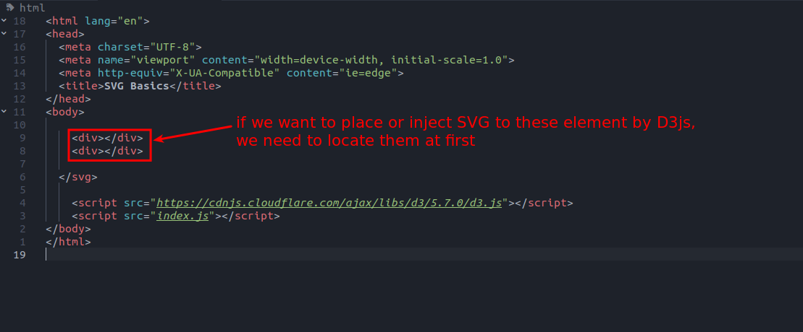
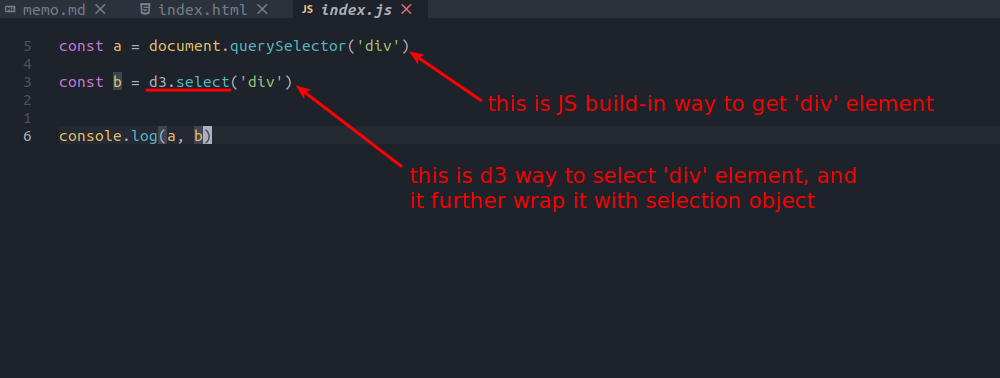
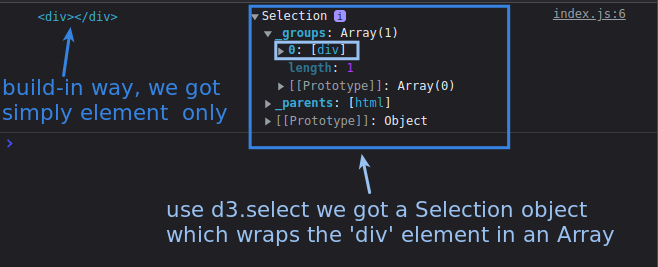
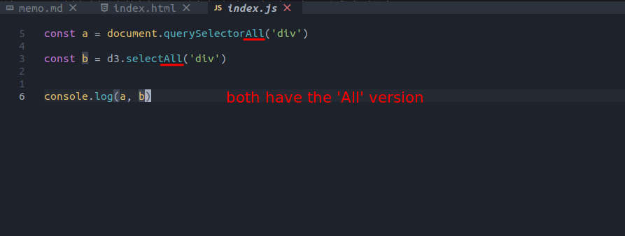
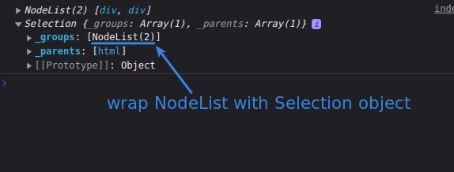

## **d3.select**

 

 

- Query way/result is the same as build-in JS method, just plus a wrapper Selection.

  - The wrapper Selection provide some methods/properties to help us place or inject SVG in the target element.

 

## **d3.selectAll**

 

 

- Be careful that it wrap the whole NodeList to the first place of an array, so it is nested array.

