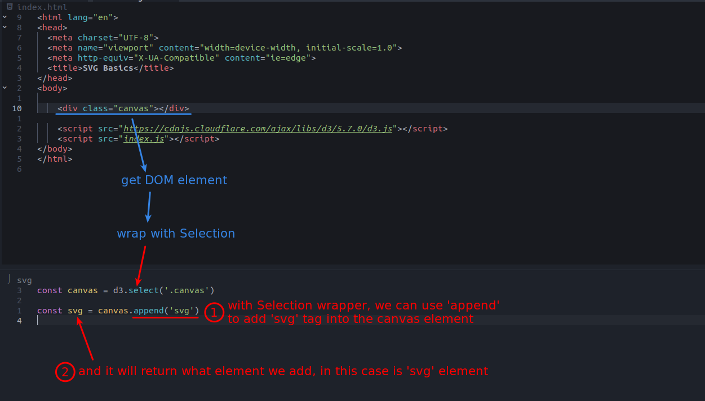
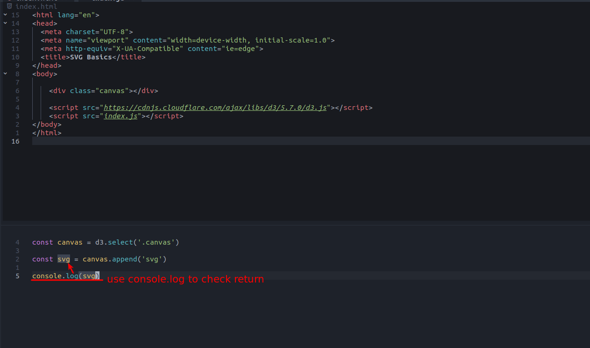
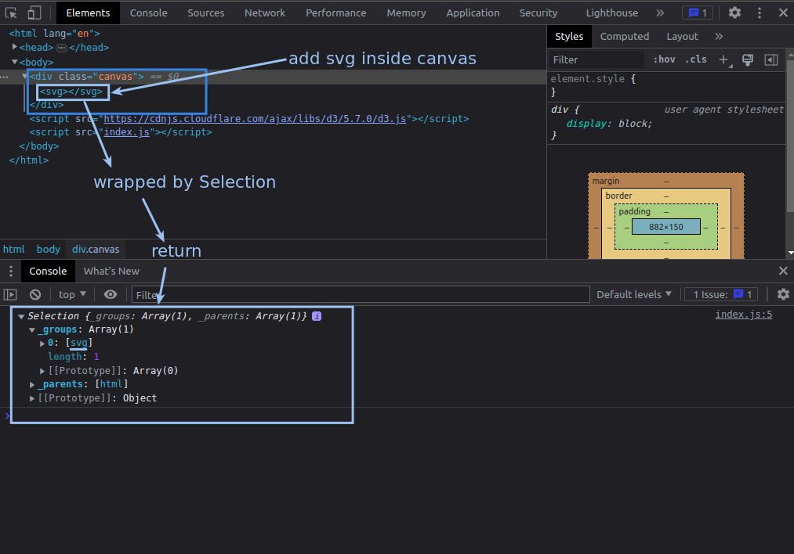
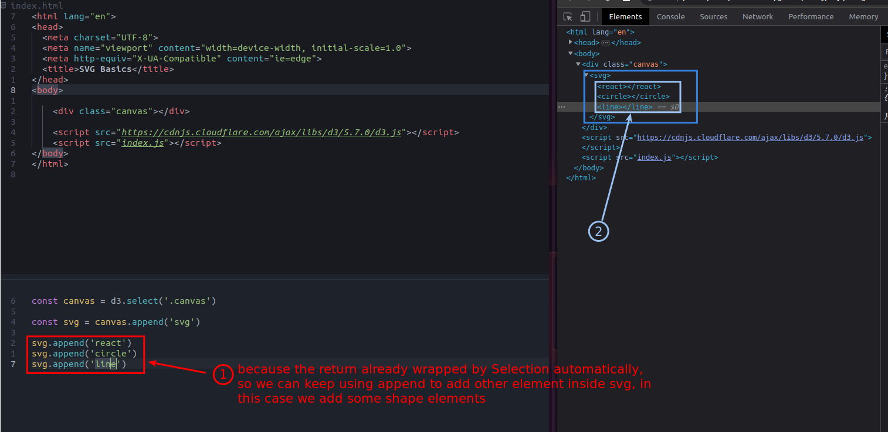

## **Selection.append**

 

 

## **Keep using .append with what we add**

 

 

- We don't need to append other element to the shapes, so don't need return anymore.

- We can use Selection to append all kinds of element, not only for shapes.
