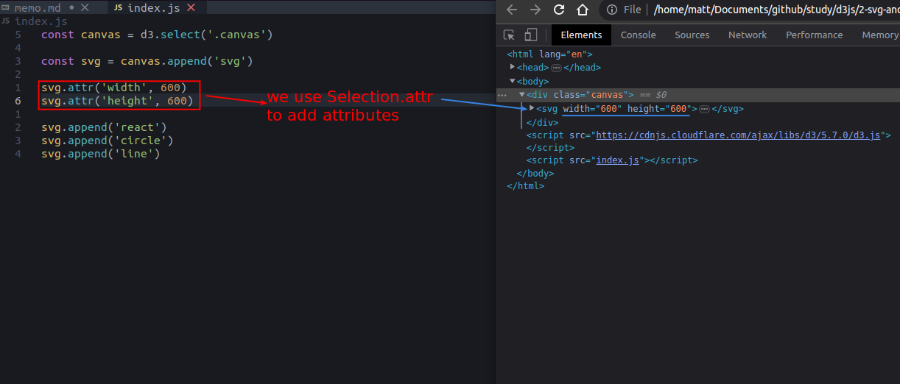
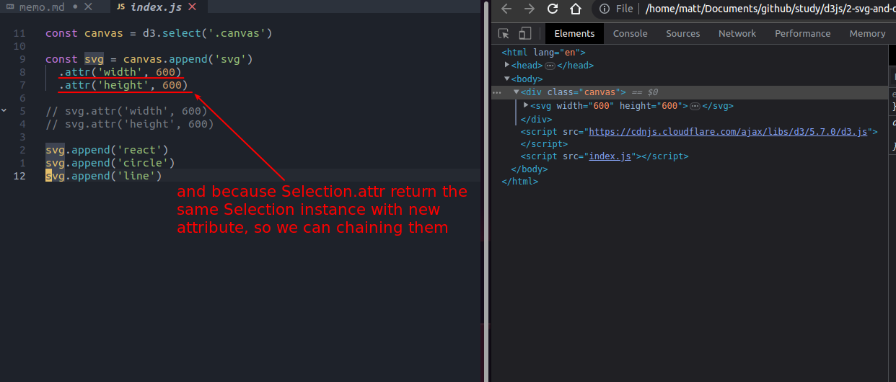
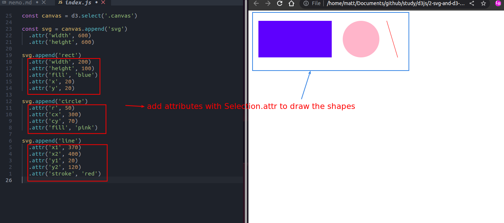

## **Selection.attr**

 

## **Chaining methods**

 

- When we use chaining methods, we must be very clear about what each method returns, otherwise we will get unintended results.

## **Practice: drawing the shapes out**

 
