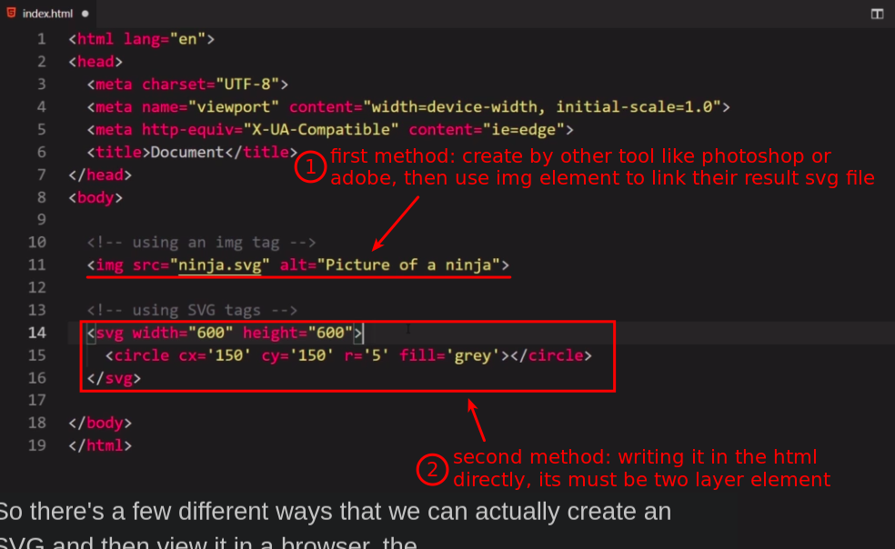

## **What is SVG?**

 

## **Three ways to use SVG**

 

- The third way is to use Javascript and D3js to create the SVG and write it into the HTML in a similar way to the second way.

  - We will use this way throughout this course.

