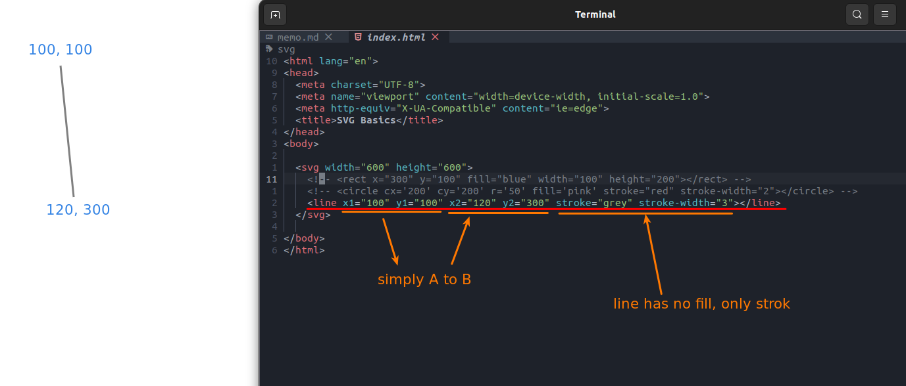

## **svg tag**

 

- this is live canvas, every SVG graph are included by it.

## **Inside tags of SVG**

- here we letrally create SVG chart, any every has its different properties for the graph settings.

### _react_

 

### _circle_

 

### _line_ 

 
