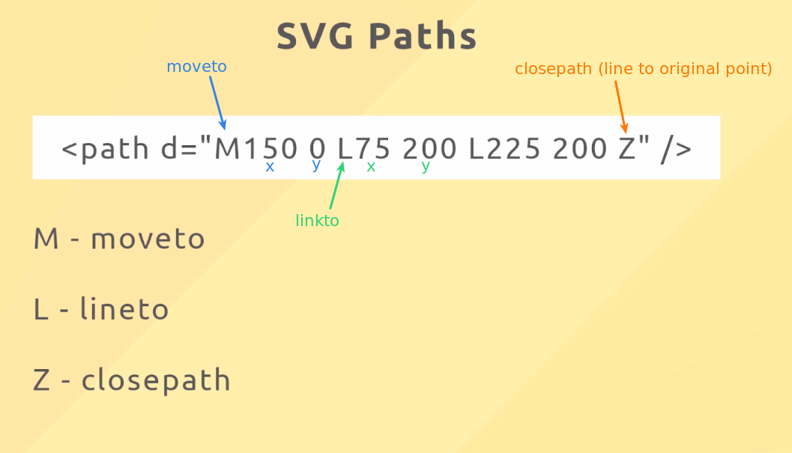
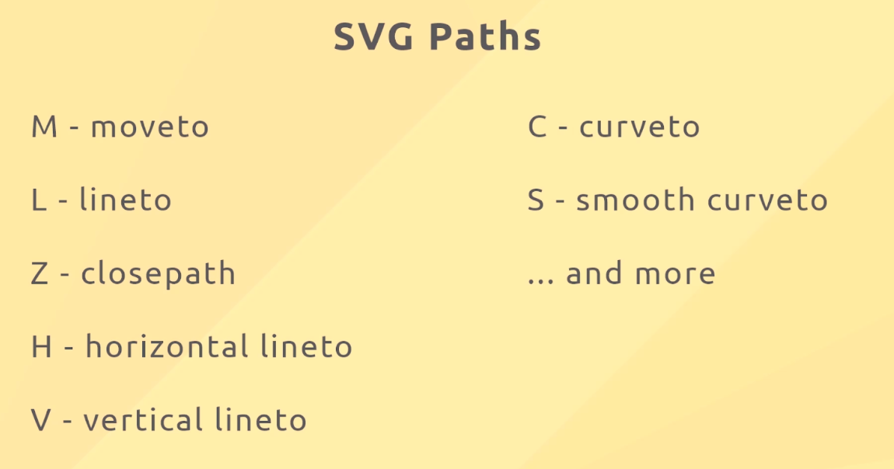
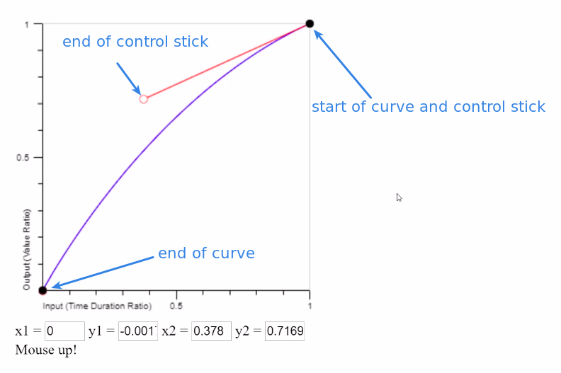
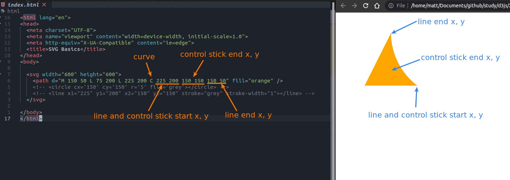
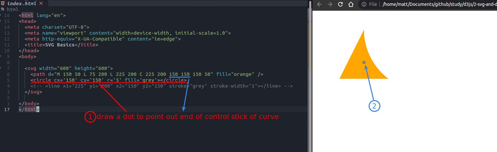
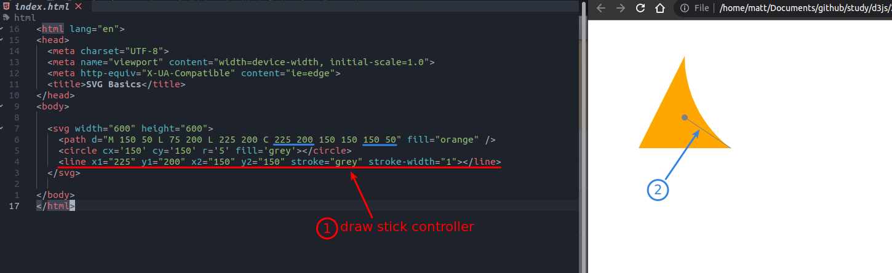

## **SVG path**

### _basic_

  

- Imagine you take a pen and draw a line on a canvas, path is this concept, path is defined by the "d" attribute.

### _there are lots about keywords of path_

 

## **Curve of Path**

### _concept_

 

### _start drawing_

**curve**

 

**control stick of curve**

 

