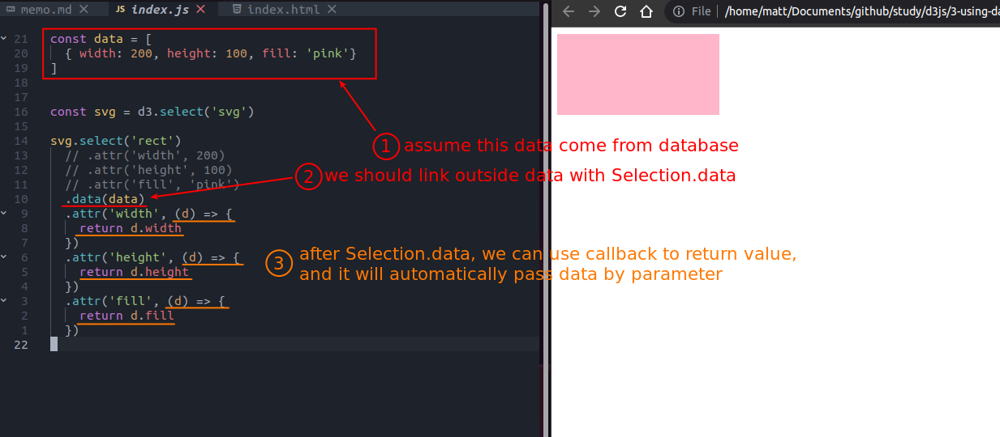

## **Prepare**

 

## **Selection.select on the element with small scope**

 

## **Selection.data**

### _hard coding value_

 

### _more shapes_

 

### _more datas_

 

### _more parameters to callback_

 
