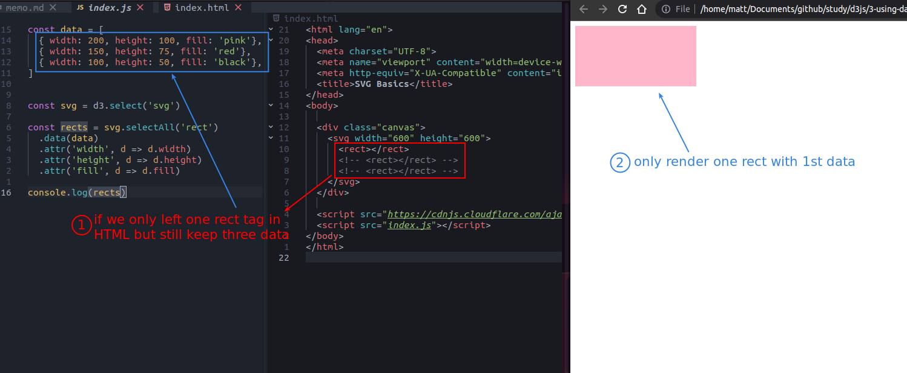
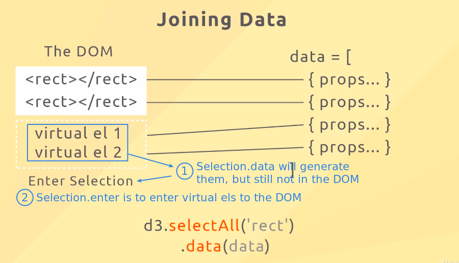
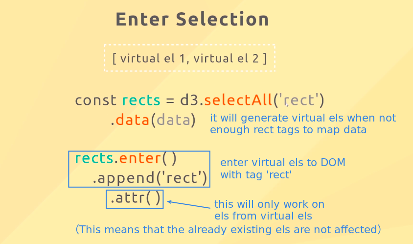
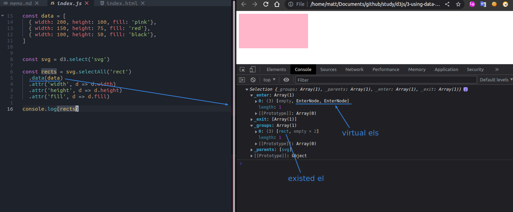
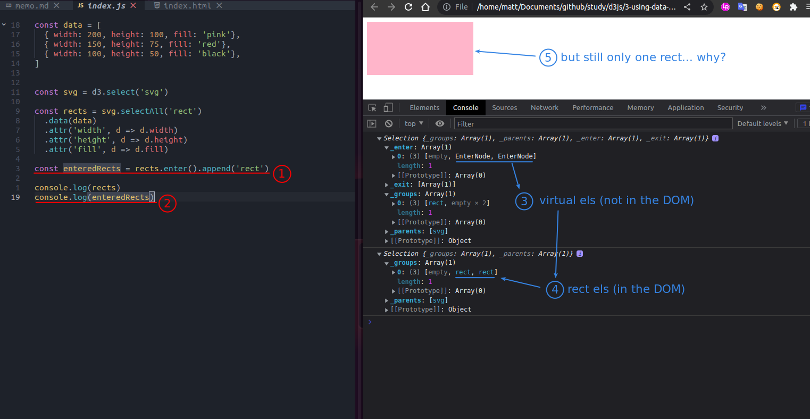
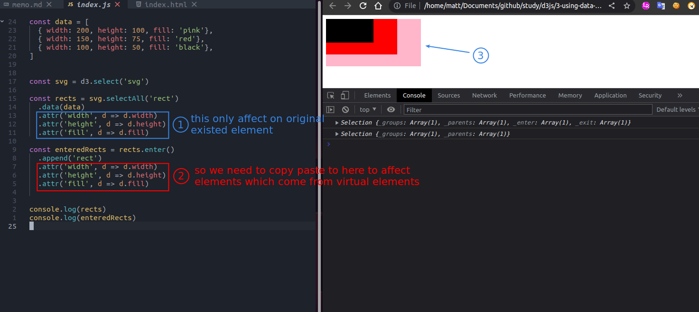

## **Problem: if tags in HTML are not enough for the data**

 

## **Slides**

 

 

## **Coding**

### _make virtual data by Selection.data_

 

### _put virtual data to DOM by Selection.enter_

 

### _let Selection.attr work on all els_

 

