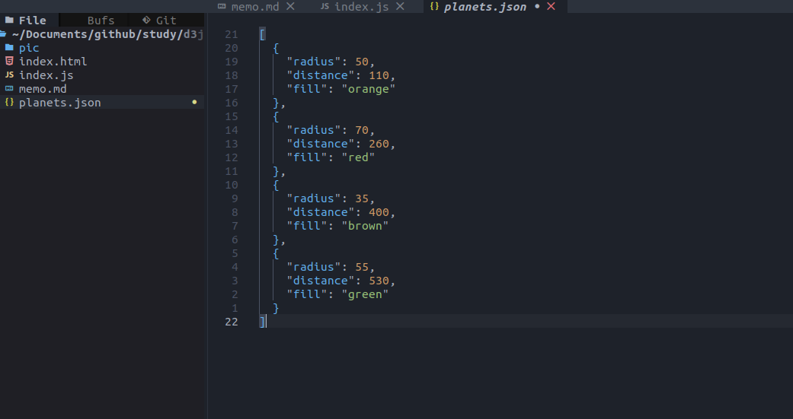
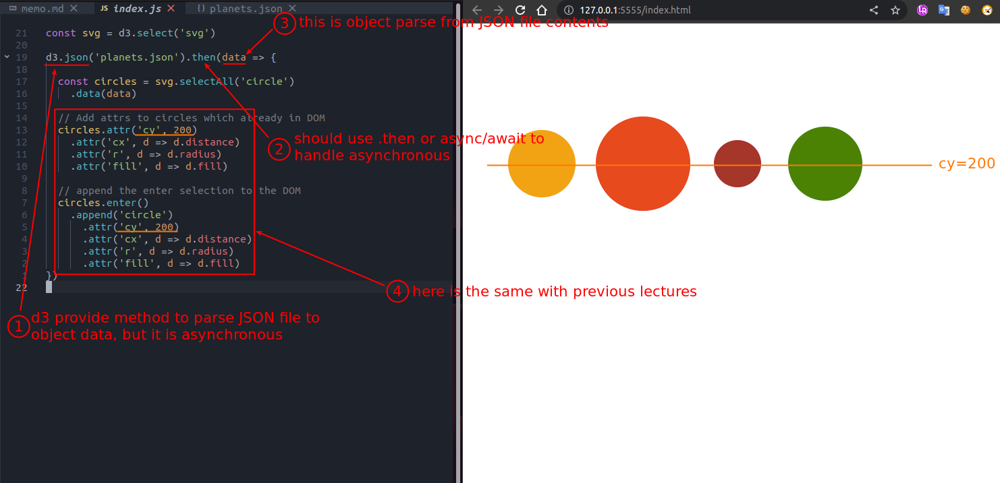

## **Data driven by JSON file**

 

 

- appending 'circle' might be seems wierd because we even use any circle, but it's fine because it will generate virtual elements anyway.

- even we sure that we have no circle element in HTML, but we still need to use .attr for that already in DOM, because after updating maybe there will be some elements already in DOM.

- Simple use d3.json to fetch/parse JSON file to object.

  - not like build-in fetch to get response then data, d3.json get data directly.

