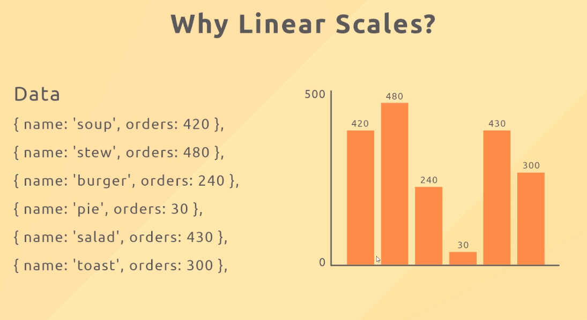
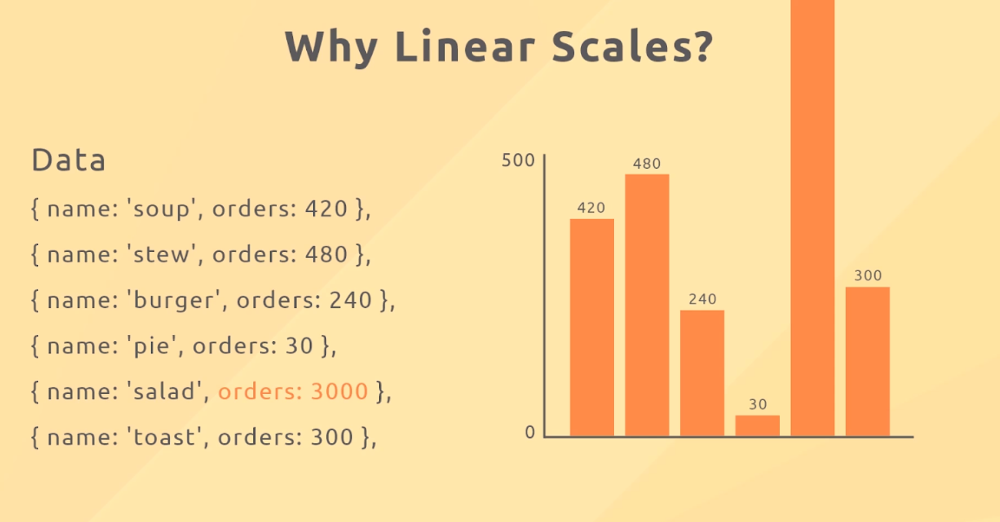
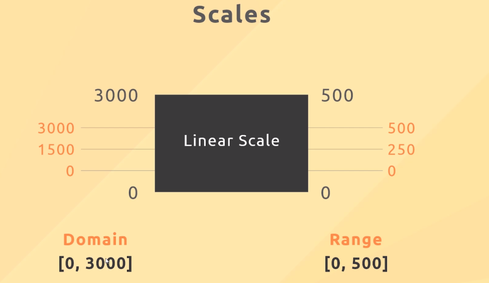

## **Barchart**

 

- its simply group by some basic shapes (line, rect).

## **Problem: too high order**

 

## **linear scale**

> scale is to compute another value from its value, it means that the size of the latter is based on the former.

 

- not only linear scale, there are various kinds of scale.
