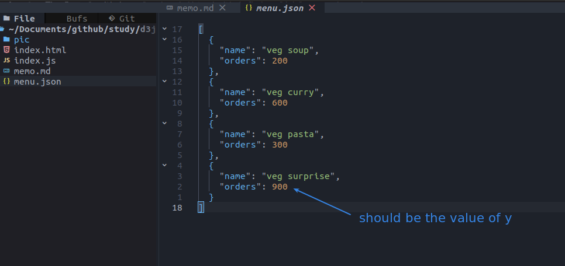
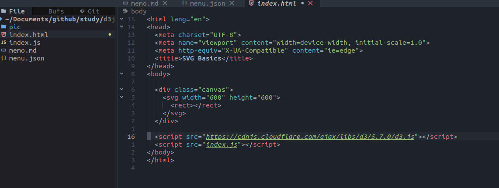
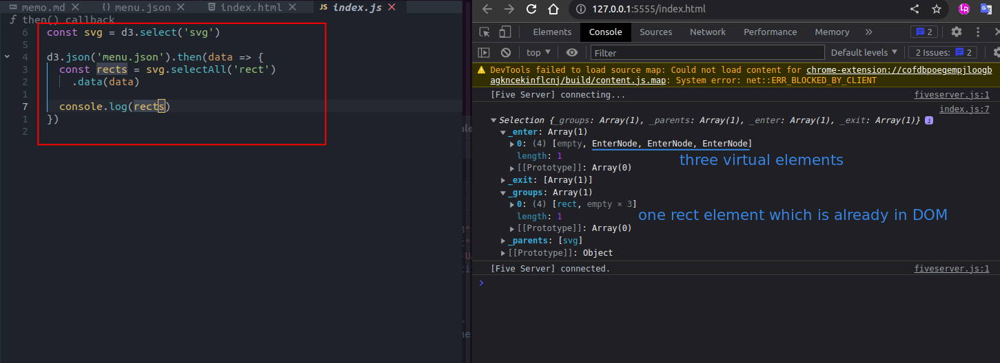
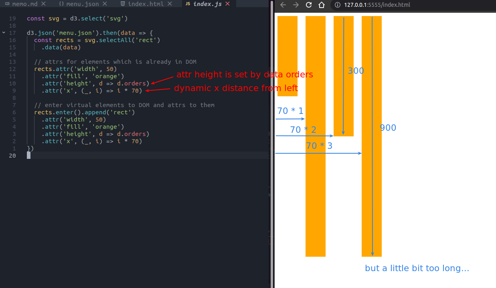
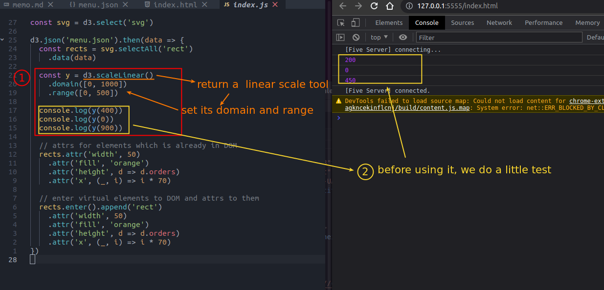
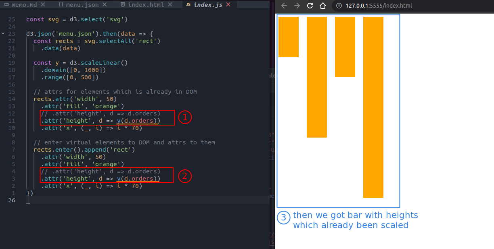

## **Prepare data, html**

  

 

## **load data by Selection.data**

 

## **Draw barchart with raw orders to heights**

 

## **d3.linearScale**

### _test_

 

### _Draw barchart with scaled orders to heights_

 
