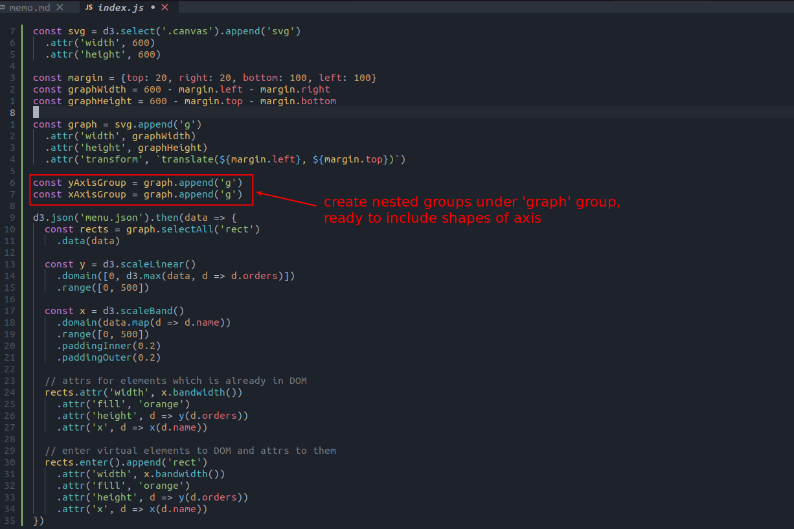
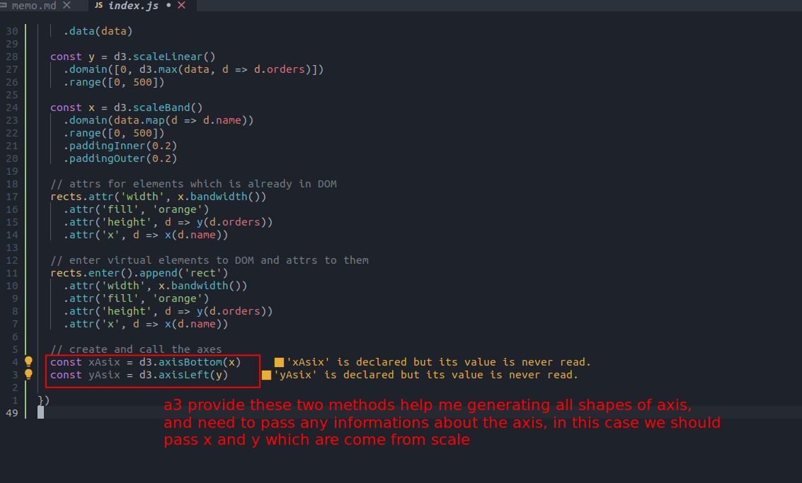
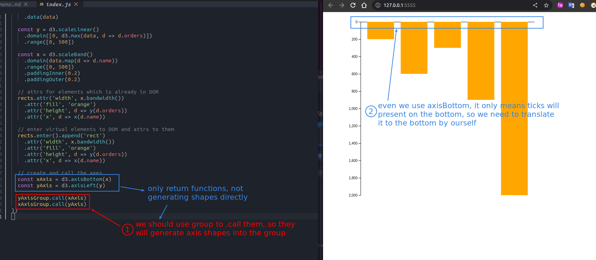
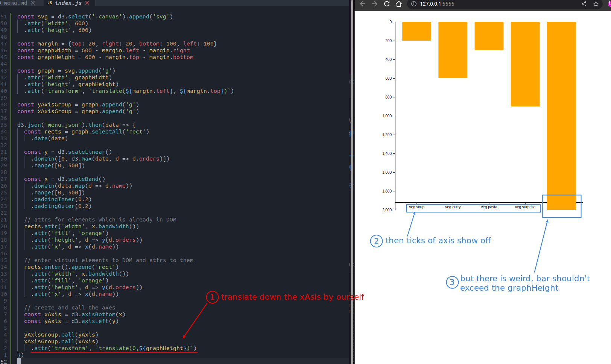
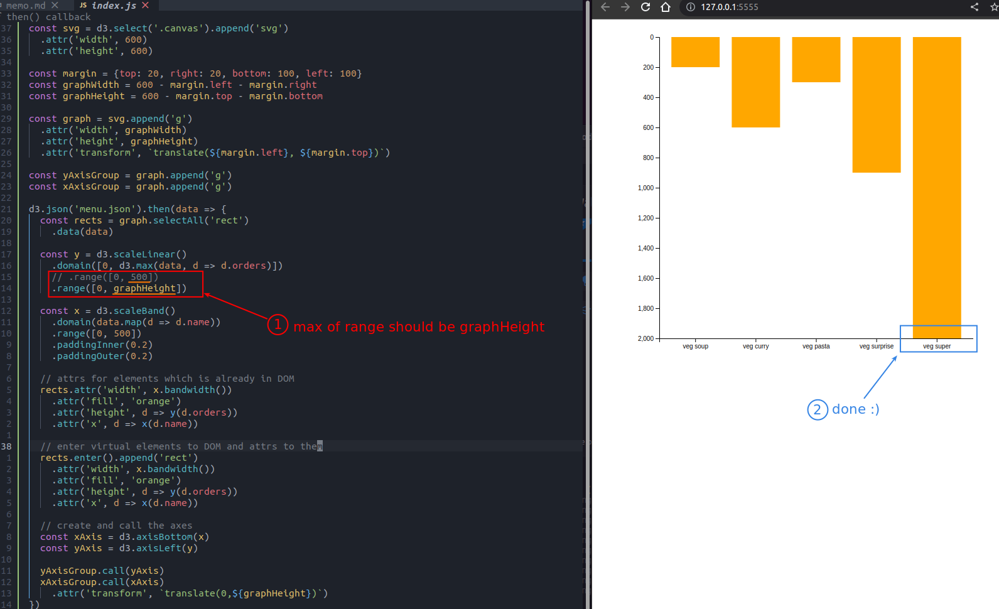

## **Nested groups: Container of Axis shapes**

 

## **d3 methods for generating axis shapes automatically**

 

 

## **fix problems**

### _x-axis no ticks_

 

### _bar exceed the graph height_

 
