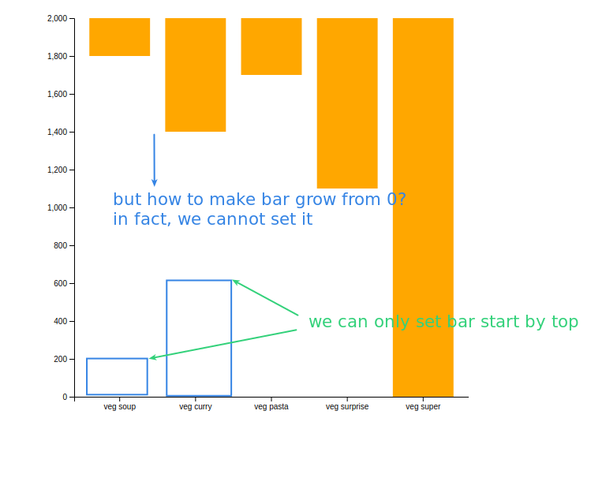

## **Reverse y-axis**

  

 

## **Recover height of bars**

> We had to invert the y-axis to change the linear scale setting, but this also affects the height of the bar, so it must be adjusted back, obviously by subtracting the current height from the graph height can achieve it.

 

## **Make bars grow from y-axis=0**

> In fact, there is no direct way to set rect to grow from the bottom to the top, only to set the top y coordinate of rect and then grow it down, but fortunately we actually know how to get the correct top y coordinate.

 

 
