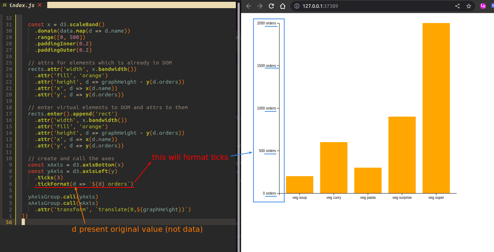

## **Formatting ticks of y-axis**

> d3.axis not only return function to generate shapes of axis, it can be chaining to do some axis formatting.

### _.ticks_

 

### _.tickFormat_

 

## **Formatting ticks of x-axis**

> In addition to using the method provided by d3, we can directly select text elements and give them attributes for formatting, which is closer to native Javascript

### _inspecting_

### _transform: rotate_

 

### _text-anchor_

 
