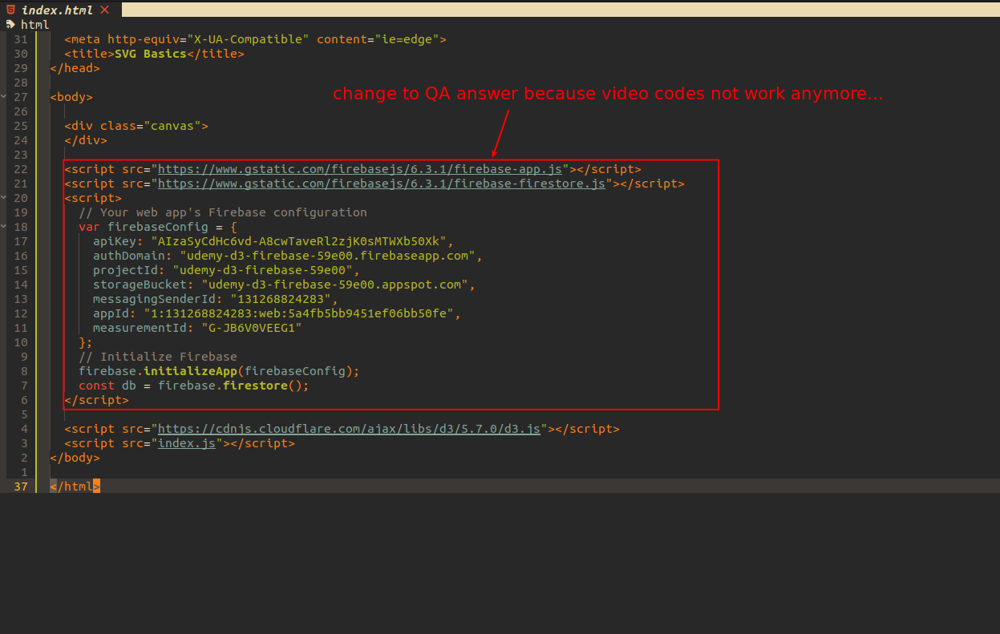

## **Walkthrough of connecting our app and firestore**

 

 

 

 

- Something has gone wrong here, the approach in the course video has been discarded, so it fails.

 

- https://www.udemy.com/course/build-data-uis-with-d3-firebase/learn/lecture/12054252#questions/8339662

  - check here for more details settings.

