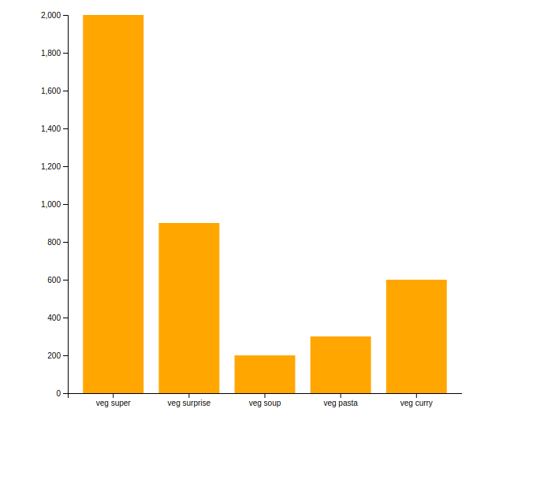
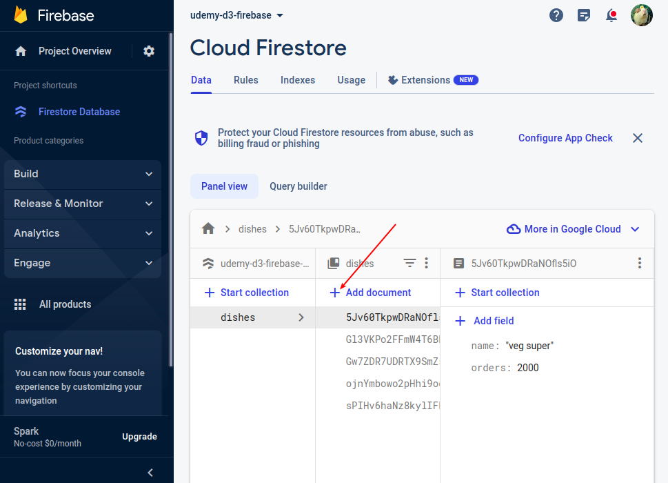
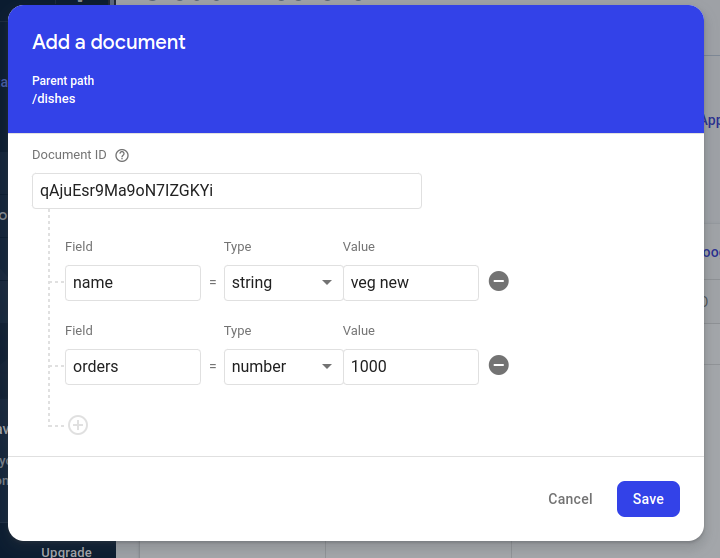
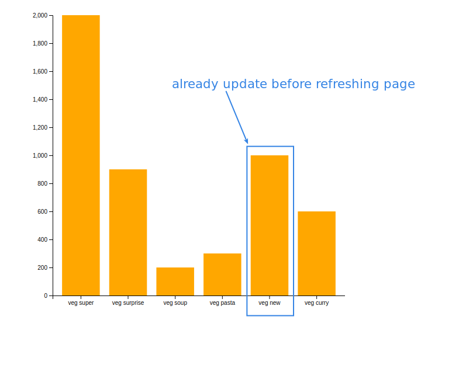

## **Barchart relecting existed documents**

 

## **Adding new document in the firestore**

 

 

## **Result in the barchart**

 

- In fact, before page refreshing, barchart should not have changed.

  - We should know few things to let our barchart to listen firestore data changing.
