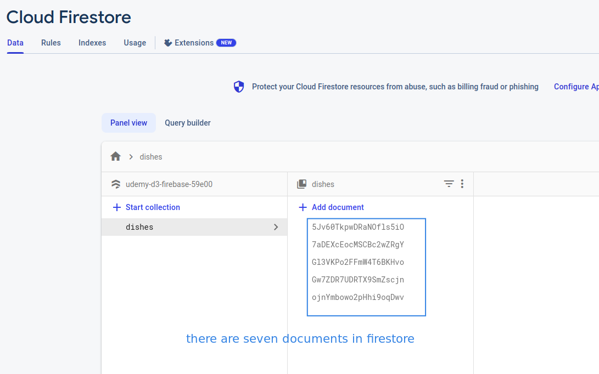
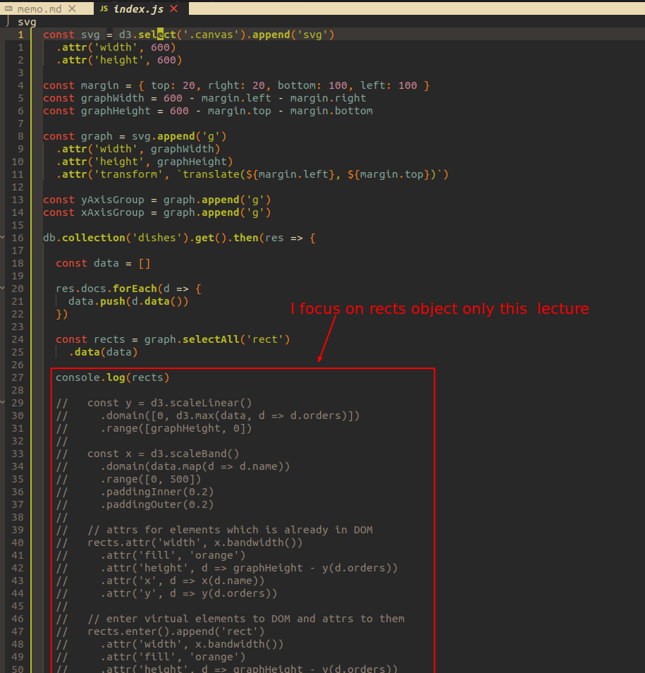
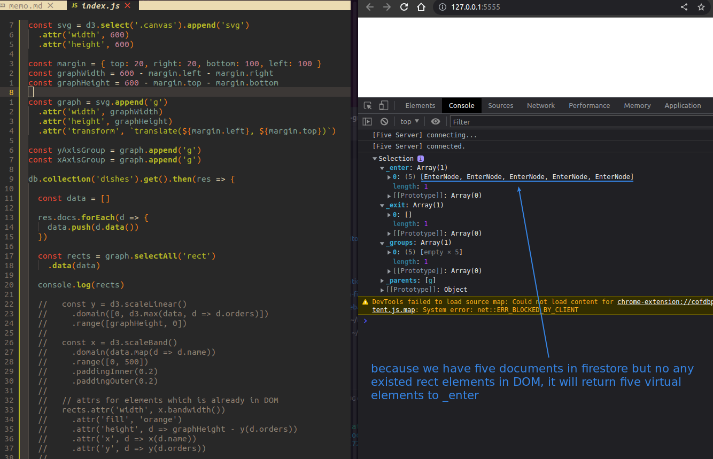
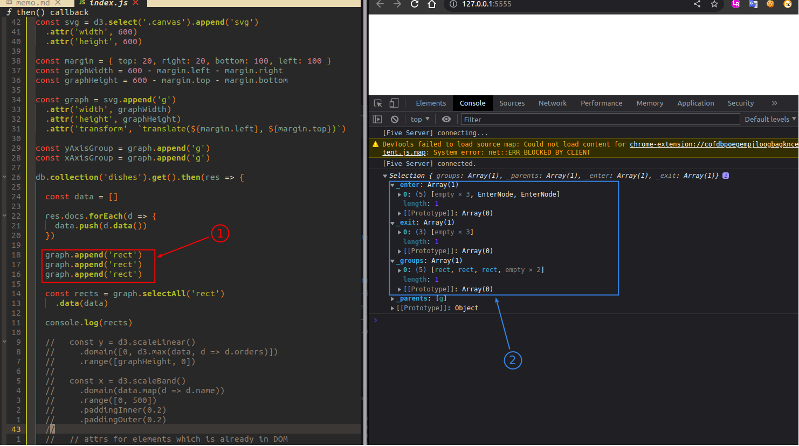
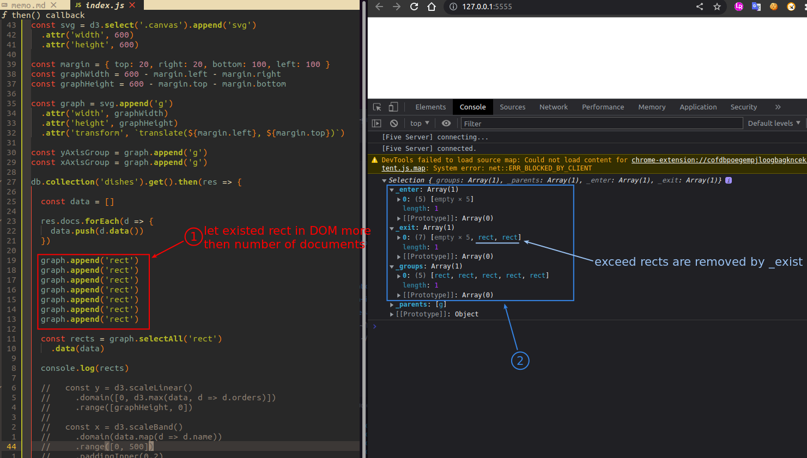

## **Prepare the experiments**

 

## **Selection.data() return**

### _if there is no existed rects in DOM_

 

### _num of existed rects more than docs in firestore_

 

### _num of docs in firestore more than existed rects_

 

## **Conclusion**

- _enter is for virtual elements (not in DOM)

- _exit is for removing elements in DOM

- _group is for elements, which is already in DOM
