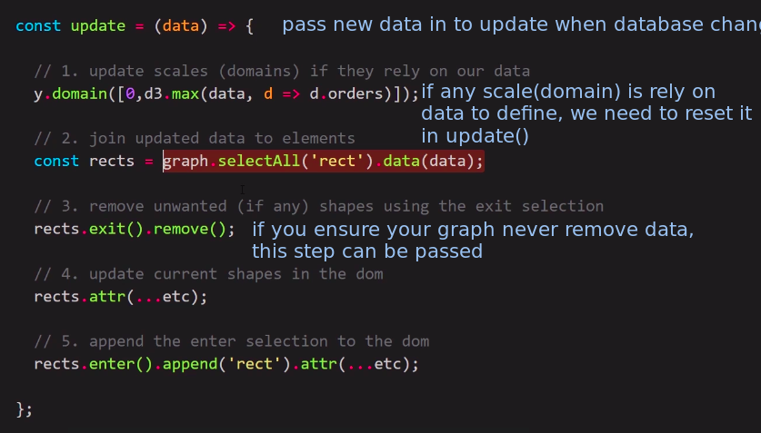

## **Preivew steps of update()

> Our app will listen to database, every time database has changed, it will call update() to update graph.

 

- The steps of update() are roughly as shown above, with occasional minor changes.
