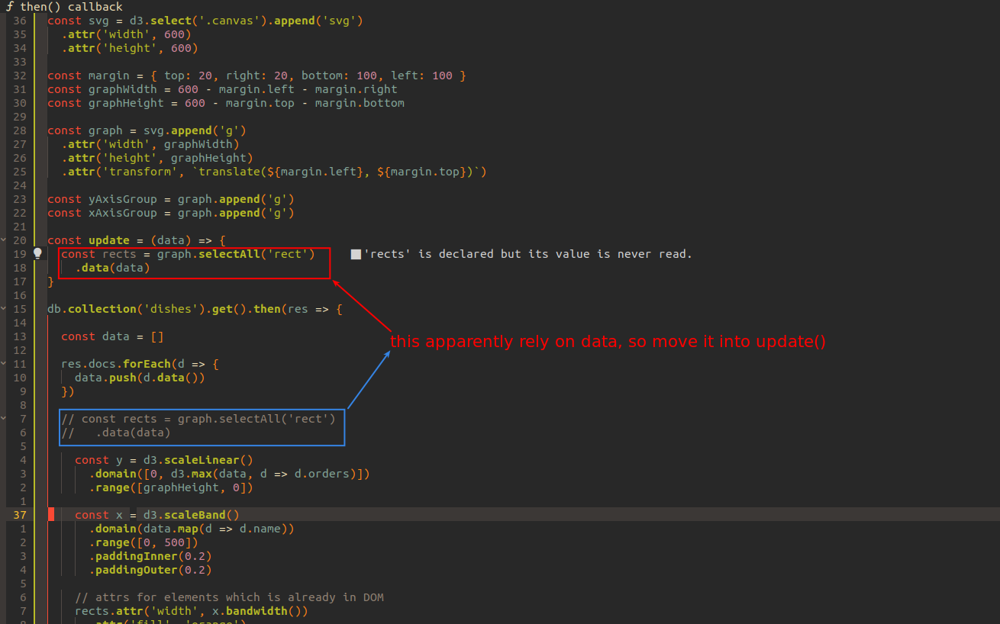

## **Create structure of update() before loading data**

 

## **Step: Join and load data to elements**

 

## **Step: Update scales(domains)**

 

### _need to follow the order from last lecture?_

 

## **Step: Render rects**

 

 

## **Not only rects, there are axes**

> Not like rect because their shapes are generated by d3 methods, so the way we treat them is not similar to rects.

 

## **Call the update with init data**

 

- make sure the barchart can be render as before.

 

- we will set listener to firestore data next lecture.
