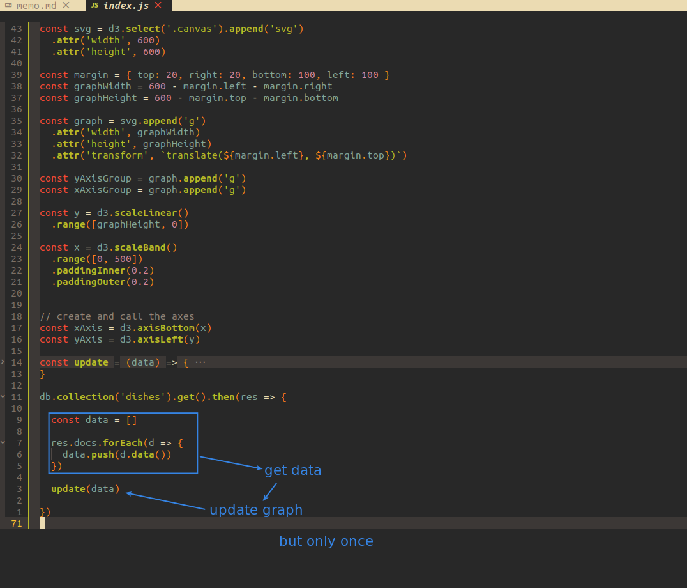
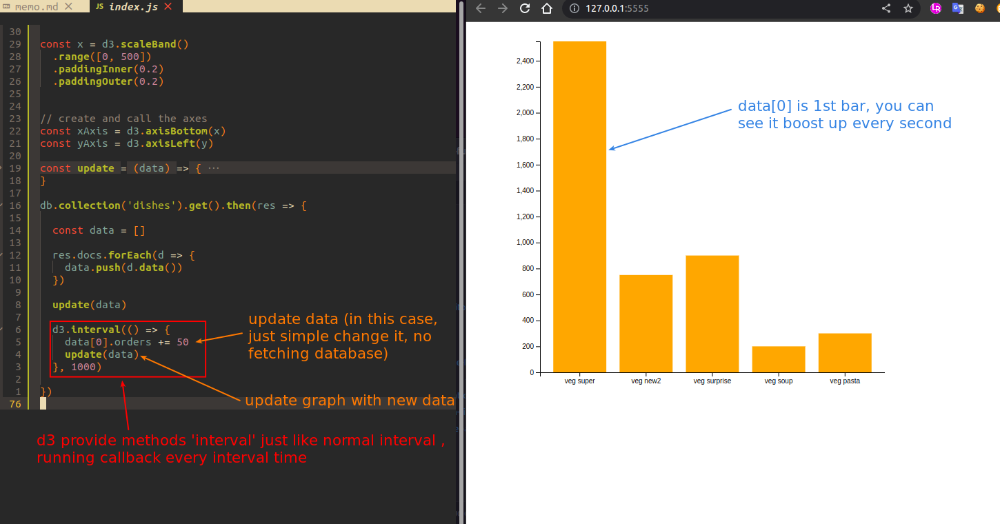

## **Previous codes: only once**

 

## **d3.interval**

 

- It is still not a way to render graphics in response to a database.

- But it seems to be very suitable for non-responsive animation (personal view).

