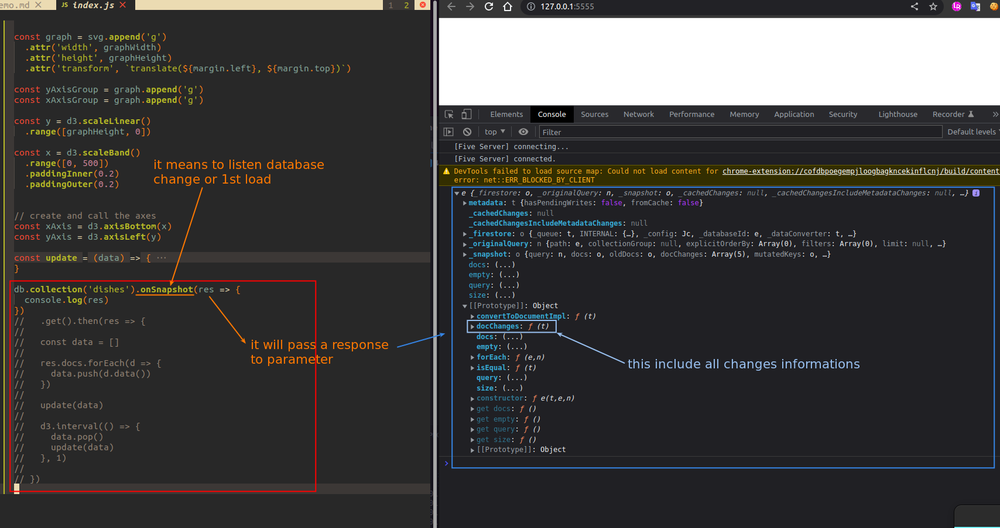
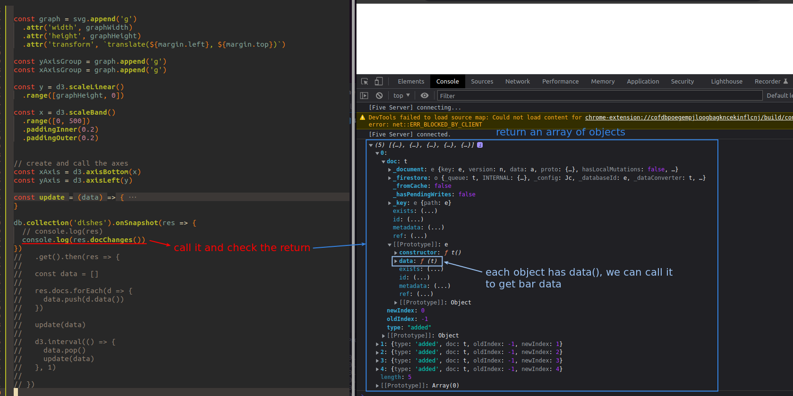
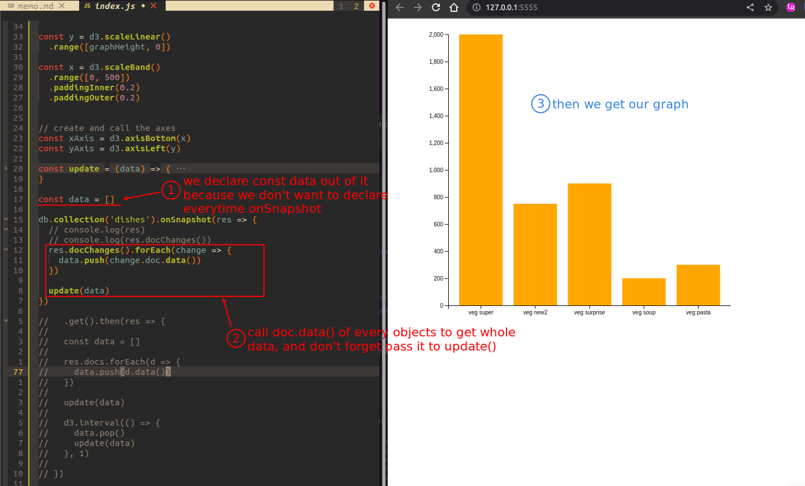

## **Listen to data loading/changing**

 

## **Analyzing the way to get data from it**

 

## **implementing it to render the barchart**

 

- In the above codes, only data.push() is used, so each time the onSnapshot callback is called, it only pushes data from database to the const data, not updating the existing data or deleting it.

  - We will solve it in next lecture.
