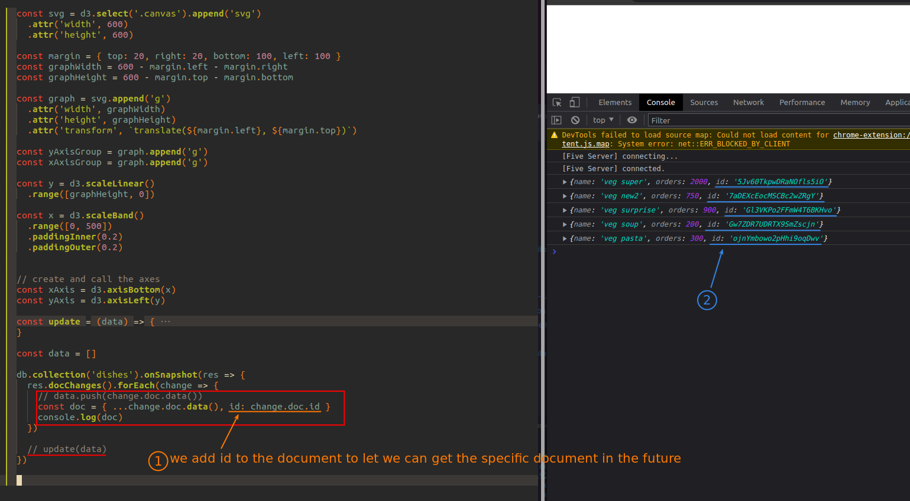
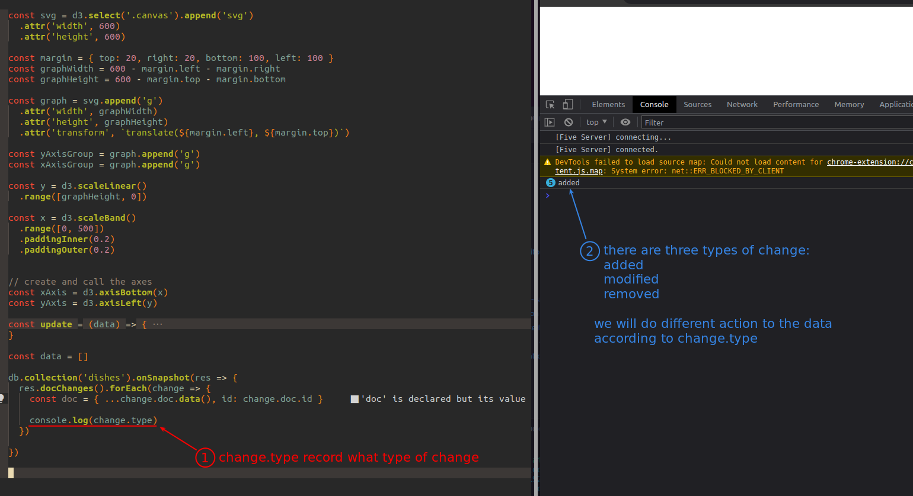
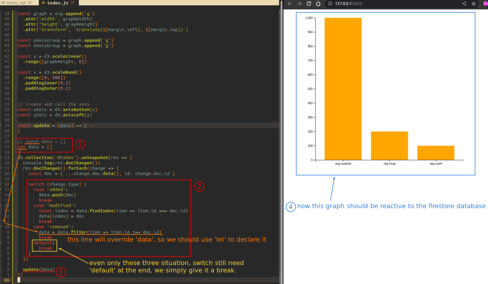

## **Including id to the document**

> Because we need to edit and delete documents that already exist in 'data', we must give the id so that we can select the specific one in the future.

## **Checking types of the change**

> There are three types of changing.

 

## **Handling each types of change**

> We should treat different types of changing by different ways.

 
