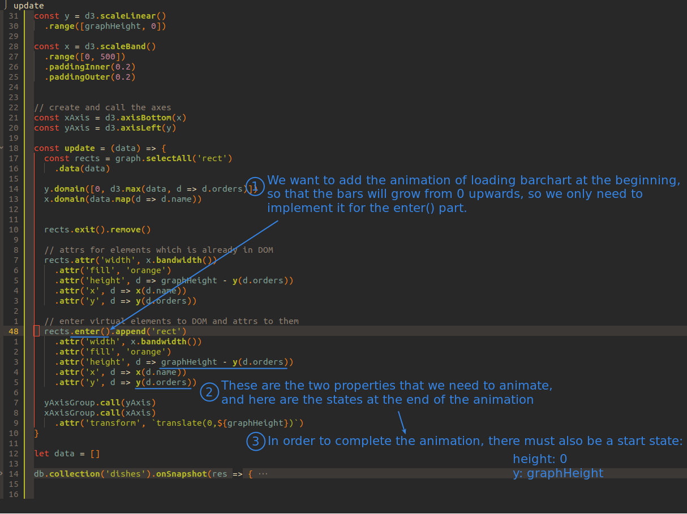
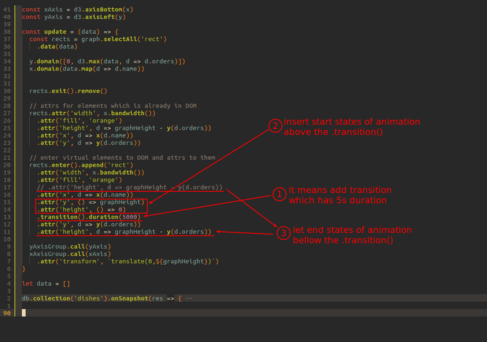
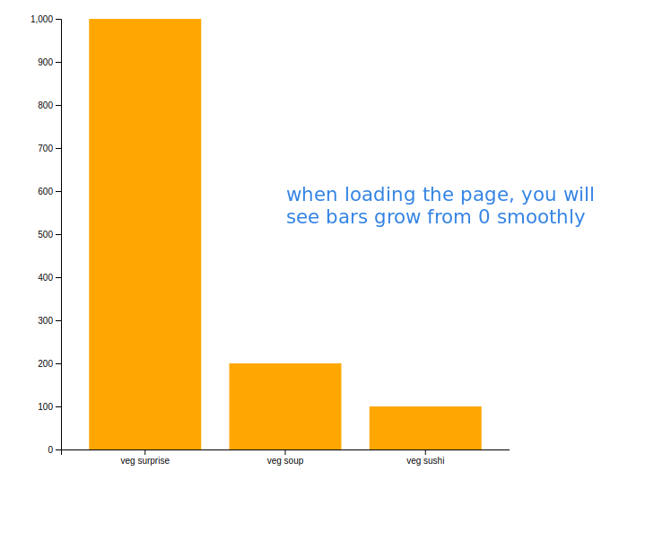

## **What you need for transition?**

 

1. What properties will change in this transition?

2. The initial and ending values of the above attribute.

  - The value at the end is the value in the data.

  - The initial value is something to think about, especially because rect actually grows from top to bottom.

## **implementing the transition**

 

- The end values are already there, but they have to be moved after the .transition()

- The initial values must be inserted before the .transition()

## **Result**

 
