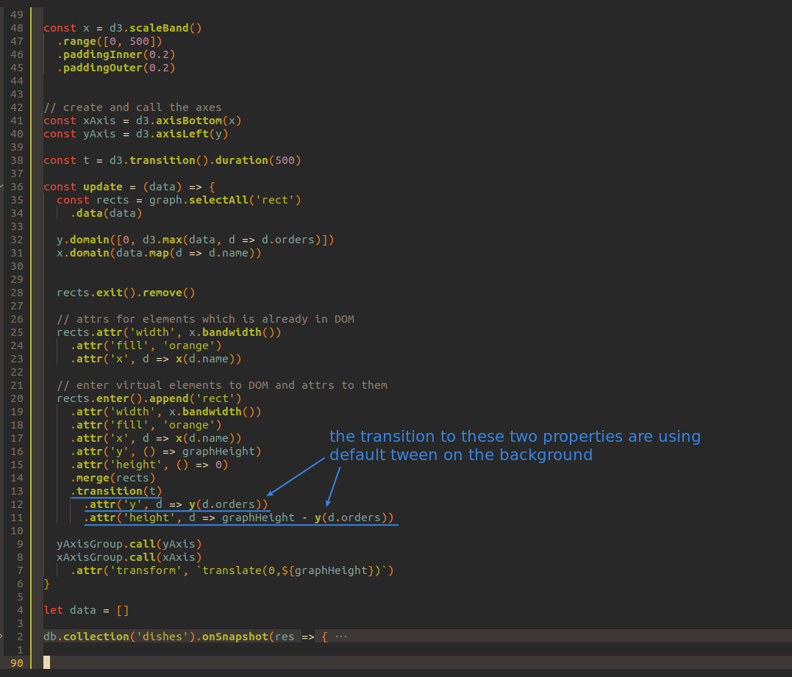
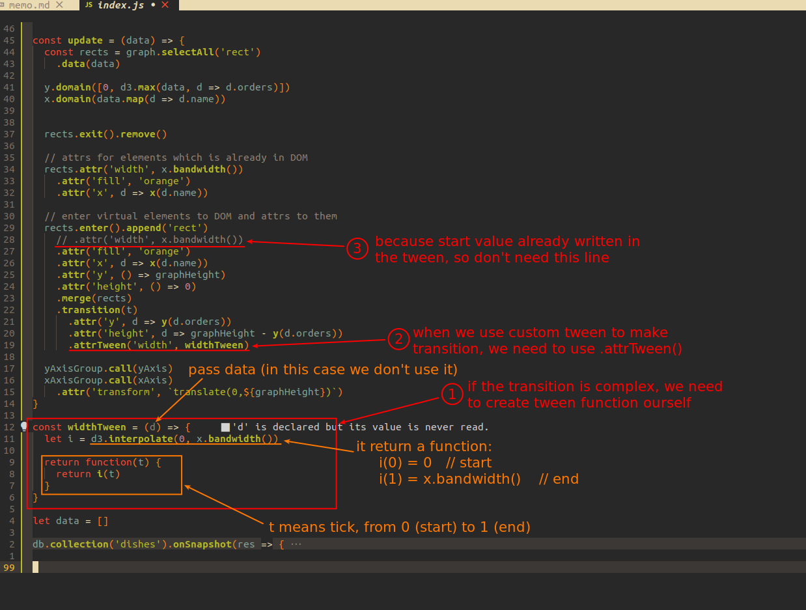
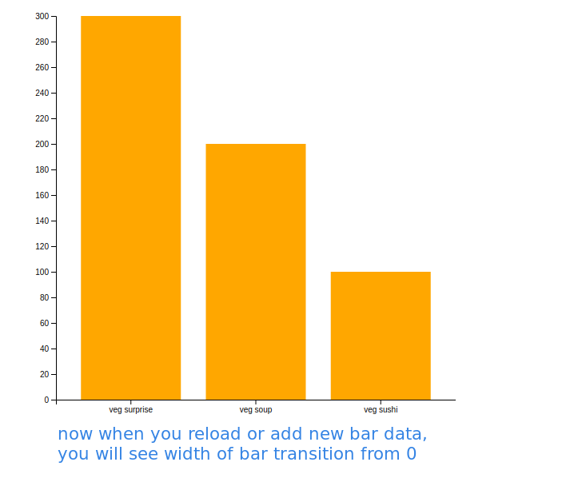

## **Using default tween to make transition**

> The way we made the transition animation before was actually using the default tween.

 

## **Using custom tween to make transition**

> If the transition is too complex, we have to make our own tween function.

 

 
