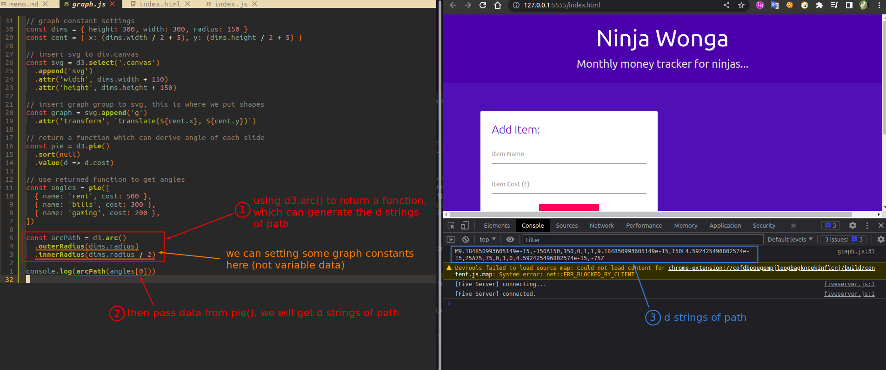
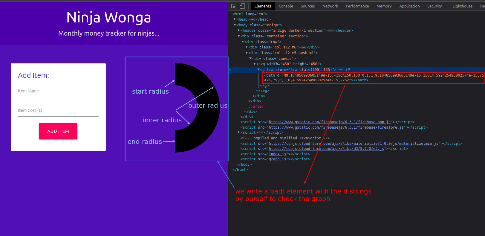

## **d3.arc() and its return function**

  

- So d3.arc() doesn't return d string directly, it still return a function.

- We can set some graph attributes, which don't changed with data following d3.arc()

## **Check the graph by writting path with d string by ourselve**

> We got d string on the console of browser, we can use it to write a path element directly on the browser to check the graph.

 
