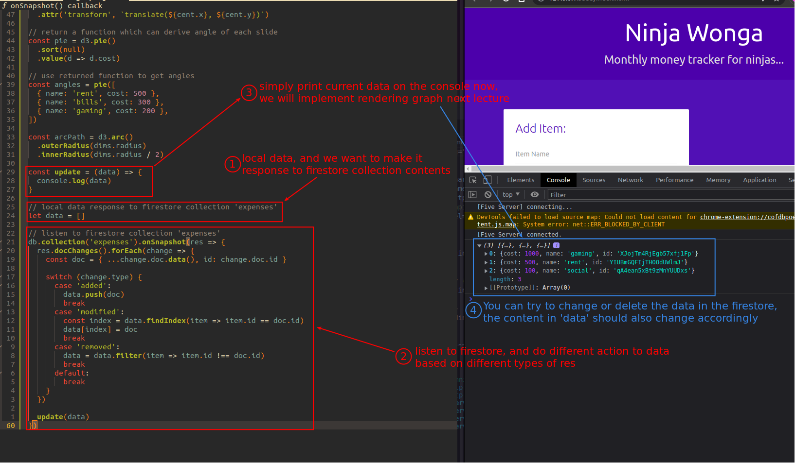

## **Listen to firestore**

  

- We make a variable on the local side of the app, the content will respond to the firestore collection.

  - After the above feature is achieved, the next lecture can render the graphics based on the data in this variable.
