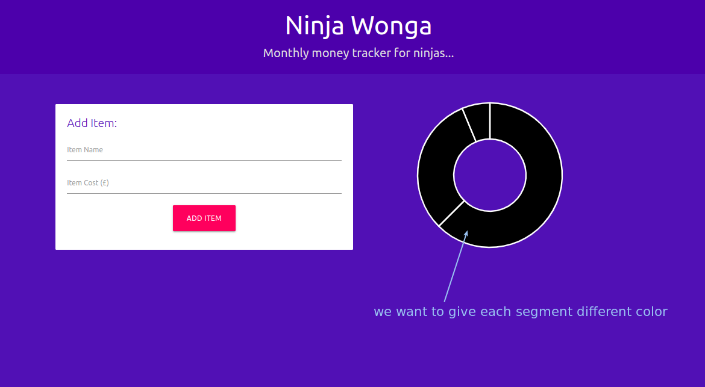
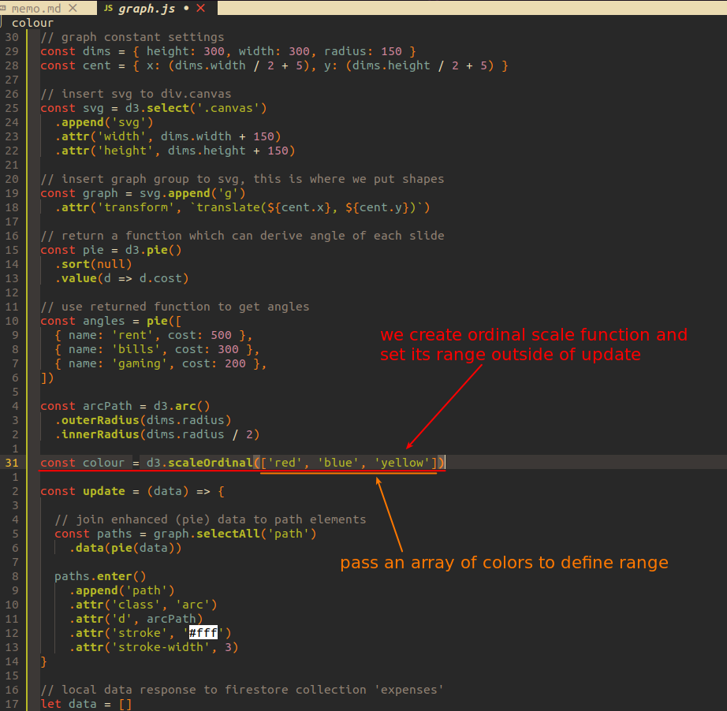
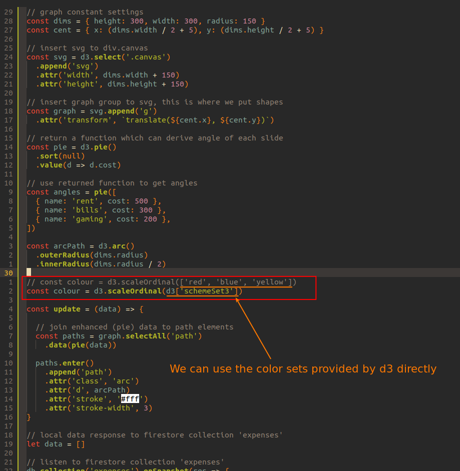
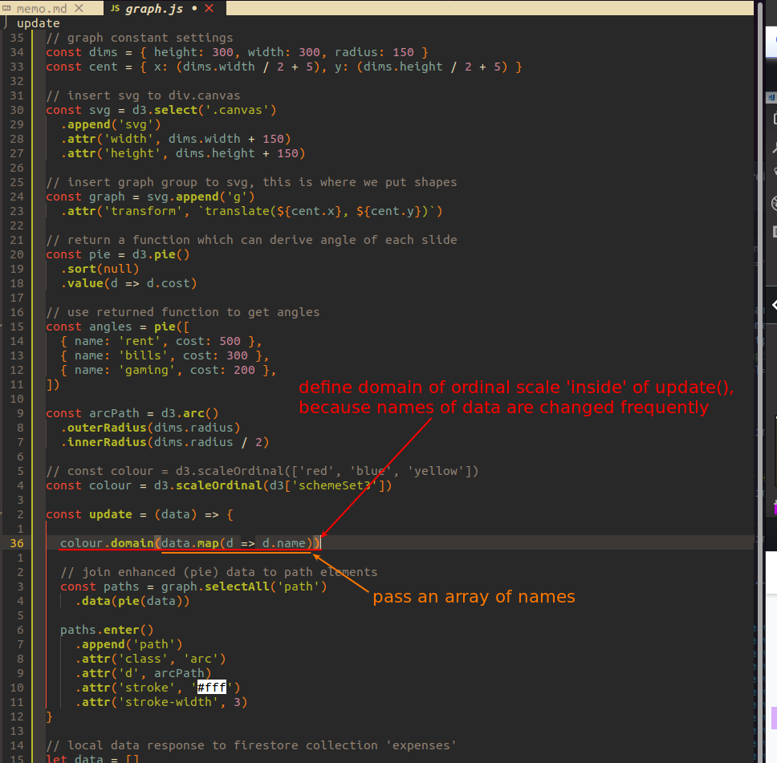
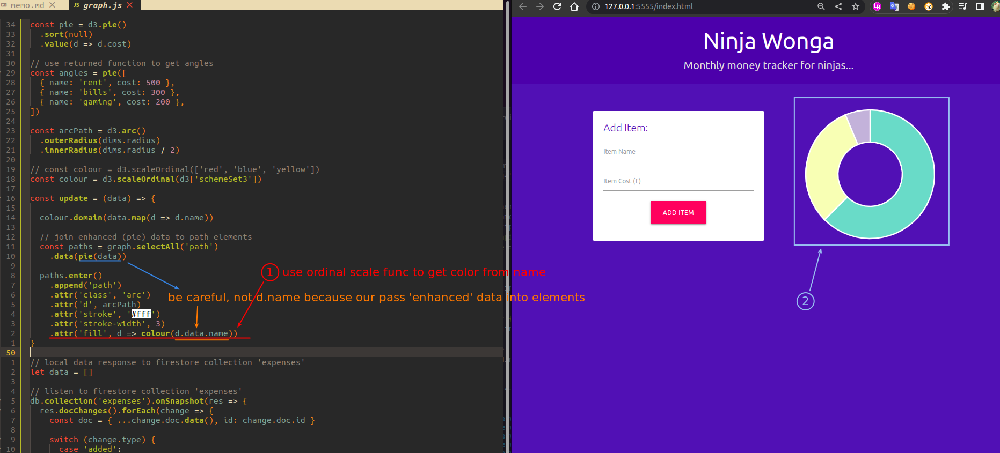

## **Goal & Concept of Ordinal Scale**

### _goal: colored segments_

  

### _concept: ordinal scale_

 

## **Definitions of ordianl scale**

### _range_

 

 

### _domain_

 

## **Using its returned function & result**

 
